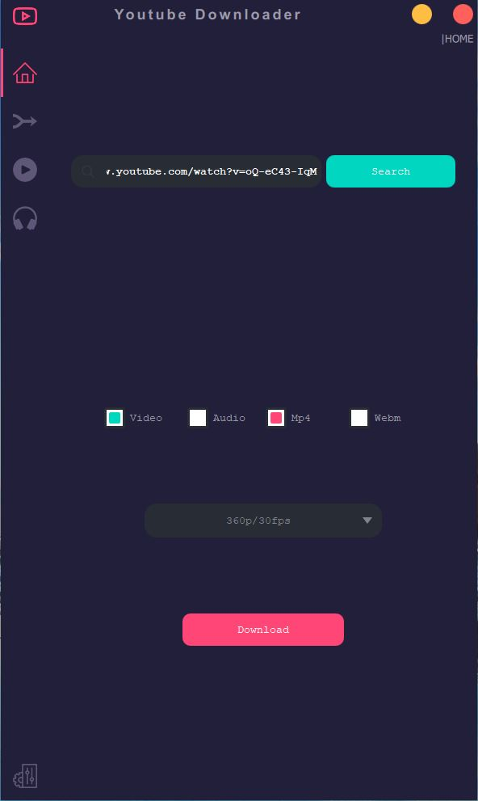
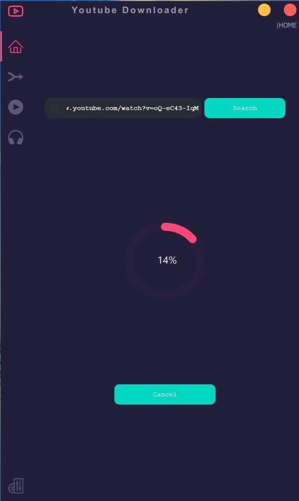
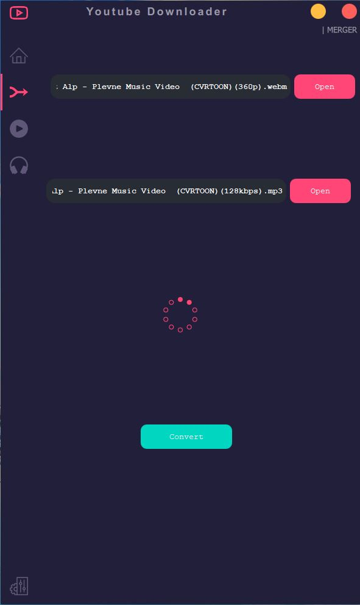
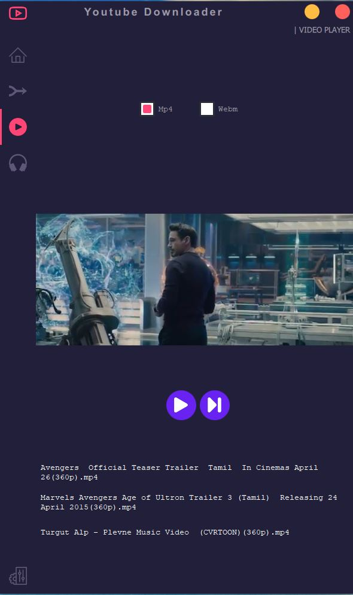
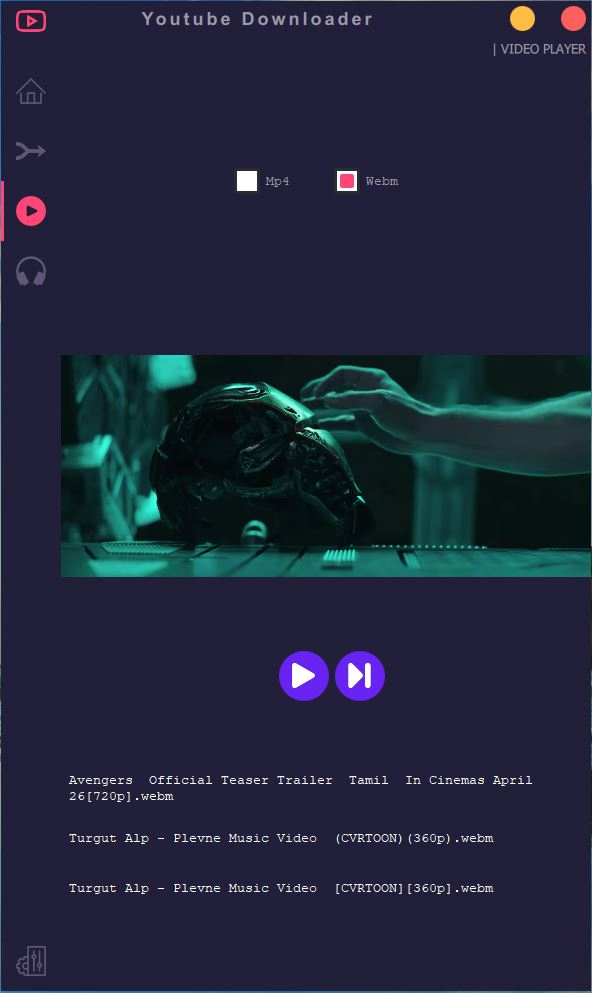
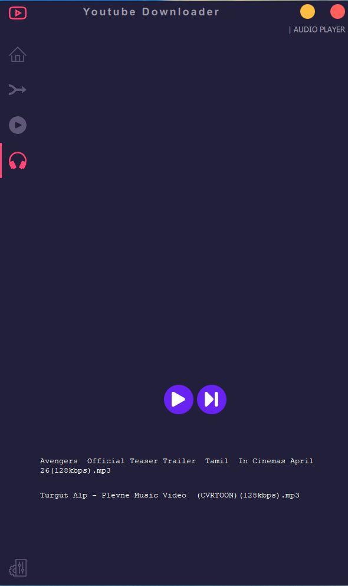
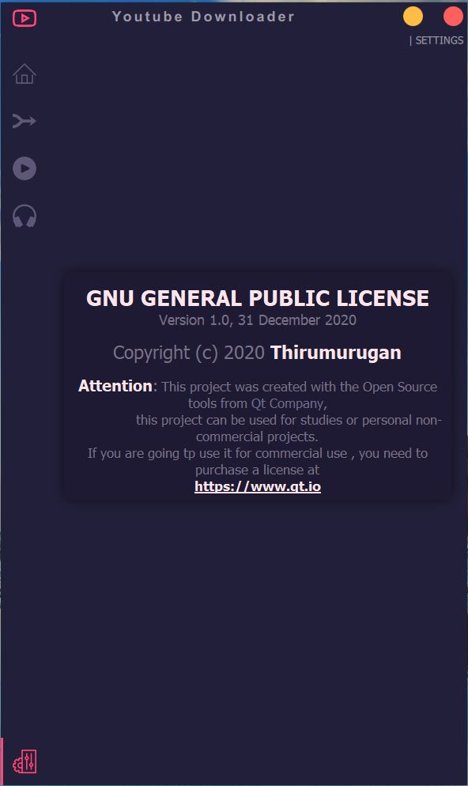

# Youtube-Video-Downloader-With-Mordern-UI
Mordern GUI Based Video Downloader
==================================
+ Version : 1.0
+ Author : Thirumurugan.C
+ Created : 2020

Description
-----------
It is a Youtube Video Downloader with mordern UI and it uses Pytube and Pyqt5 as a main framework 

## Features
+ It can download video from youtube
+ It can download audio from youtube
+ It has a facility to merge audio and video [**For the High it return only video file, so using feature we can merge it**]
+ It has a Audio Player
+ It has a Video Player

## ScreenShots
+ **Home View**

+ **Download View**

+ **Merge View**

+ **Video Player View**

+ **Webm Player View**

+ **Audio Player View**

+ **Settings View**

## Note:
For the Video and Audio player We have to install  K-Lite Codec Pack link is given below 
https://codecguide.com/download_kl.htm

For the Merger Part i used ffmpeg for we have to add assert file path to the environment variable like : **X://Project Downloaded Dir/Assert/bin/**
**If you have any doubt while using this project just ask me in issuse page**

